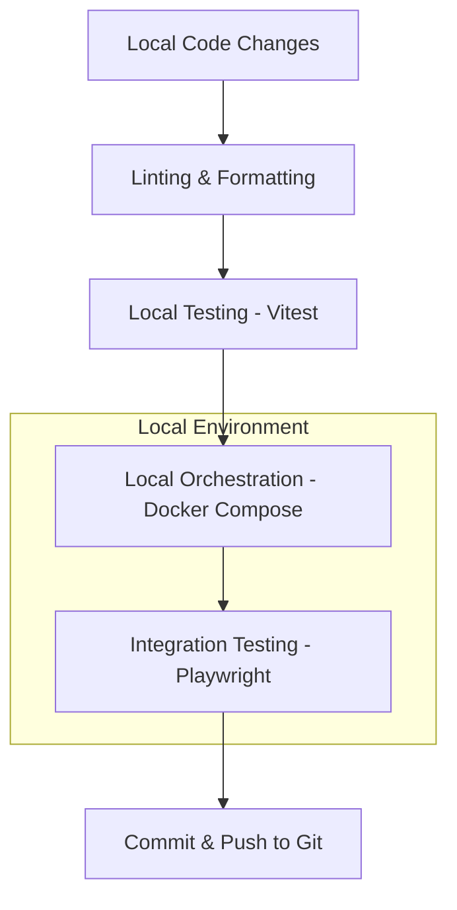
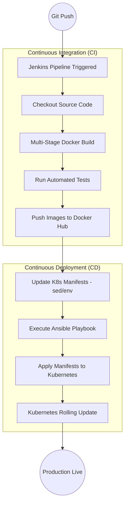

# Detailed Project Workflows: SmartFlow Tasks

This document outlines two distinct workflows: one focused on the **Application Lifecycle** and the other on **CI/CD & DevOps Integration**.

---

## 1. Application Lifecycle Workflow
This workflow focuses on the developer's experience, from writing code to ensuring it works locally in a production-like environment.

### Key DevOps Integrations in the App Lifecycle:
*   **TypeScript & ESLint**: Catch errors early in the editor and pre-commit phase.
*   **Docker Compose**: Developers run `docker-compose up` to replicate the full environment (Frontend, Backend, MongoDB) locally. This eliminates the "it works on my machine" problem.
*   **Environment Variables**: The application uses `.env` files and process environment variables (`VITE_API_URL`, `MONGO_URI`) which are swapped seamlessly between local, test, and production environments.

---

## 2. CI/CD & DevOps Integration Workflow
This workflow focuses on the automated pipeline that takes over once code is pushed to the repository.

### Detailed DevOps Tech Integration:

#### A. Jenkins (The Orchestrator)
*   **Function**: Manages the sequence of events.
*   **Integration**: The `Jenkinsfile` defines "Stages". If any stage (like tests) fails, the pipeline stops, preventing broken code from reaching production.

#### B. Docker (The Standardized Package)
*   **Function**: Packages the app and its environment.
*   **Integration**: Uses **Multi-stage builds** in `Dockerfile`.
    *   *Stage 1 (Build)*: Compiles code and installs dependencies.
    *   *Stage 2 (Runtime)*: Only copies the final artifacts into a lightweight Nginx or Node alpine image. This reduces the attack surface and image size.

#### C. Ansible (The Automation Layer)
*   **Function**: Automates infrastructure tasks.
*   **Integration**: Jenkins calls the `ansible-playbook ansible/deploy-k8s.yml`.
    *   Ansible acts as a bridge, using the `kubernetes.core.k8s` module to communicate with the cluster. It ensures that all components (DB, Backend, Frontend) are applied in the correct state.

#### D. Kubernetes (The Orchestrator)
*   **Function**: Manages the running containers.
*   **Integration**: Uses **Declarative Manifests** (`k8s/*.yaml`).
    *   **Deployments**: Manage pods and scaling.
    *   **Services**: Handle internal networking and load balancing.
    *   **Rolling Updates**: K8s ensures zero-downtime deployments by replacing old pods with new ones only after the new ones pass health checks.

#### E. Image Tagging Strategy
*   **Function**: Traceability.
*   **Integration**: Jenkins injects the `${BUILD_NUMBER}` into the Docker image tag and then uses `sed` to update the Kubernetes YAML files dynamically. This ensures that every deployment is uniquely identifiable and can be rolled back if needed.
